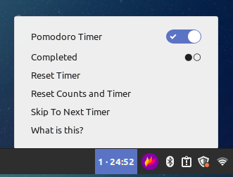
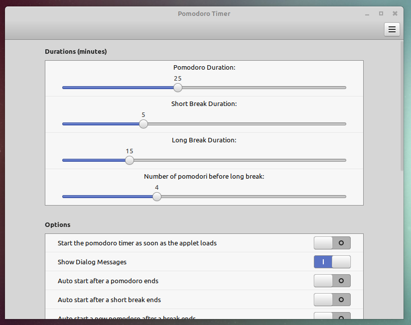
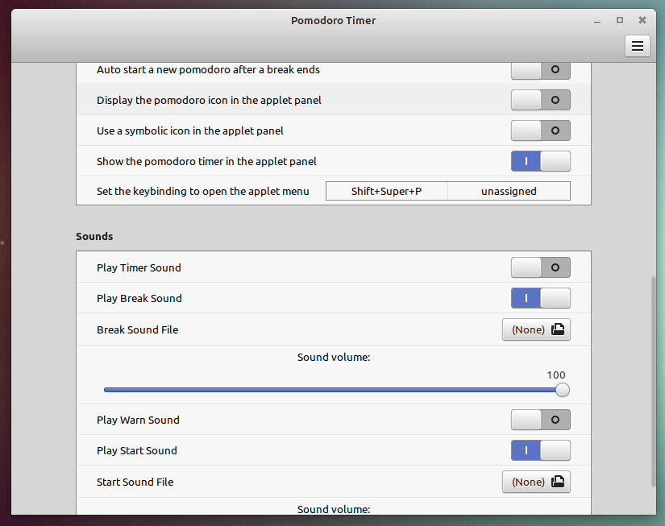

# Pomodoro Timer Applet for Cinnamon Desktop

The Pomodoro technique is used to boost productivity and this applet provides an easy way to use the technique right on your desktop.

Read more about the technique here: http://en.wikipedia.org/wiki/Pomodoro_Technique.

## Installing
* Install sox play if you want the sound capability: `sudo apt install sox`
* Extract to ~/.local/share/cinnamon/applets
* Enable the applet in cinnamon settings

## How To Use
The traditional Pomodoro technique involves setting a timer for focused work sessions followed by short breaks, and completing a long break after every few rounds to maximize productivity. Here’s how you can use this applet to boost your productivity:

1. **Activate the Timer**: Once the applet is installed and enabled, click on the applet icon in your panel to open the timer menu. Optionally you can set the timer to start automatically when you log in.
2. **Start a Pomodoro Session**: Toggle the timer on from the menu to begin a 25-minute work session. During this time, focus entirely on your task without any distractions.
3. **Take Short Breaks**: After each Pomodoro, take a short break of 5 minutes. Use this time to rest, which increases concentration for the next session.
4. **Take Long Breaks**: After completing four Pomodoros, it is recommended to take a longer break of 15-30 minutes. This helps to recover from the exertion and reset your mental energy.
5. **Customize Your Timers**: Access the applet settings to adjust the duration of the Pomodoros, short breaks, and long breaks to suit your personal productivity rhythm.
6. **Use Keyboard Shortcuts**: Set up a keyboard shortcut via the applet settings to quickly access the timer menu without needing to use the mouse.
7. **Monitor Your Progress**: The applet keeps track of how many Pomodoros you have completed during the day, encouraging you to stay focused and reach your daily goals.
8. **Reset or Skip Timers**: If you need to end a session early, you can reset the current timer or skip to the next session through the applet menu.

For optimal productivity, try to avoid pausing the timer once a Pomodoro has started, as the technique is most effective when sessions are completed in one go.

## Tips

### Understanding Dialog Windows and Auto Start Settings

The applet provides configurable settings that affect how timers transition from one state to another—whether through manual interaction via dialog windows or automatically.

**Dialog Windows**
- **Purpose**: Dialog windows serve as interactive notifications that prompt you to manually proceed to the next timer. They are crucial for ensuring you consciously acknowledge the transition from work to break, or from break back to work.
- **Usage**: When dialog windows are enabled, you must manually start the next timer by clicking a button in the dialog. This is useful if you want to control when to actually start the next session, providing a moment to prepare or adjust based on your current task or condition.

**Auto Start Options**
- **Purpose**: Auto start settings allow for an uninterrupted workflow by automatically starting the next session—be it a Pomodoro, short break, or long break—without user interaction.
- **Usage**: 
  - **Pomodoro and Short Break**: If auto start is enabled for these timers, the next session will commence immediately after the current one ends, without showing any dialog, regardless if the dialog window option is enabled or disabled.
  - **Long Break**: The auto start for a long break can work concurrently with dialog windows. When both are enabled, a dialog window will appear at the start of the long break showing a countdown. If the auto start after long break is also enabled, this dialog will automatically close when the countdown finishes, and a new Pomodoro will begin.

### Best Practices for Configuring Settings

- **Maximize Focus**: Enable auto start for Pomodoros and short breaks if you want to maintain a strict work rhythm without interruptions, ideal for deep focus sessions where maintaining momentum is crucial.
- **Stay Informed and Rested**: Use dialog windows with long breaks to stay informed about the break period but still enjoy the benefit of automatic transition back to work, ensuring you don’t skip necessary rest.
- **Balance Flexibility and Structure**: If your work requires flexibility, use dialog windows for Pomodoros and short breaks and disable auto start to decide when you're truly ready to move on. This setup helps manage work that may need sudden shifts or extensions in activity time.

### Tailoring to Your Workflow

Experiment with different configurations to find the optimal setup that enhances your productivity without causing burnout. The goal is to leverage the Pomodoro technique in a way that best suits your daily routines and work demands, adjusting settings as needed to accommodate changes in your work intensity or focus requirements.

## Features
* Customize timer durations for the pomodoro, short and long breaks
* See how many pomodoros you have completed
* Configure what is shown in the panel, options include an icon and the timer counting down
* Optionally play and configure sounds such as timer start and end
* Show dialog windows at the end of the timers so you know to take a break
* Auto start the timer when you first log in
* Set a keyboard shortcut to open the applet menu and then use arrow keys to select options
* Quickly reset the timer state or skip to the next timer if you want to end early

## Screenshots







## Changelog
- 1.0.1
    - Added option to automatically start the timer on log in
- 1.0.0
    - Added keyboard shortcut to open the applet
    - Added new dialog option to show after a pomodoro ends
    - Added applet menu option to skip the current timer, useful if you want to end early
    - Updated code to use ES6 for easier updates in future

## Local Development

- Clone this repository and install the files into the Cinnamon applet directory:
    ```shell
    $ git clone git@github.com:gfreeau/cinnamon-pomodoro.git
    ```
- Then call `update-applet.sh` to install/overwrite the applet (assumes applets are stored in `~/.local/share/cinnamon/applets/`). This works great for local development as it will overwrite the applet installed from cinnamon spices as well.
    ```shell
    $ ./update-applet.sh
    ```


## Creating and Updating Translations for Cinnamon Applets

### Preparing for Translation

- **Navigate to the Translation Directory**: First, make sure you are in the `po` directory where the translation files are maintained.

   ```shell
   $ cd po
   ```

### Creating a New Translation

- **Initialize the New Translation File**:
   Use `msginit` to create a new `.po` file for the language you want to translate to. For example, to create a French translation file from the template `.pot` file:

   ```shell
   $ msginit --locale=fr_FR --input=pomodoro@gregfreeman.org.pot --output-file=fr.po
   ```

   This command will create a `fr.po` file based on `pomodoro@gregfreeman.org.pot`.

- **Edit the Translation File**:
   Open `fr.po` in a text editor and translate the messages. In the `.po` file, fill in the `msgstr` fields with your translations corresponding to each `msgid`.

### Updating an Existing Translation

- **Open the Existing `.po` File**:
Open the `.po` file for the language you are updating in a text editor and make the necessary changes to the translations.

### Compiling the Translation

- **Generate the .mo File**:
   Once your translation or updates are done, compile the `.po` file into a `.mo` file to make it usable by the applet. Use the `msgfmt` command:

   ```shell
   $ msgfmt -o pomodoro@gregfreeman.org.mo fr.po
   ```

   This will create `pomodoro@gregfreeman.org.mo` from the `fr.po` file.

### Testing and Installation

- **Install the Compiled Translation**:
   Move the compiled `.mo` file to the appropriate directory:

   ```shell
   $ mv pomodoro@gregfreeman.org.mo ~/.local/share/locale/fr/LC_MESSAGES/
   ```

- **Restart Cinnamon**:
   To apply the translation, restart the Cinnamon environment by pressing `ALT-F2`, typing `r`, and pressing `Enter`.

### Contributing Back

- **Submit Your Translations**:
   Contribute your translations back to the community by submitting them to the [original repository](https://github.com/gfreeau/cinnamon-pomodoro). This involves involves creating a pull request with your updated `.po` files.
